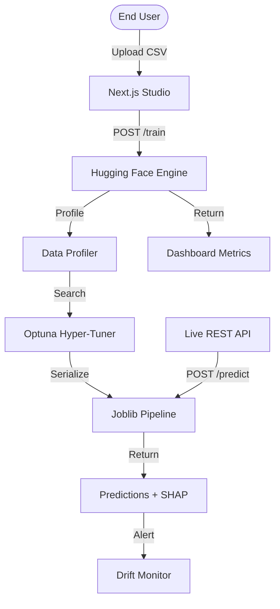

<div align="center">
  
  <h1>AutoStack AI — The Autonomous ML Lifecycle Platform</h1>
  <p><b>Production-grade ML workflow from Raw CSV to Low-Latency REST API in under 60 seconds.</b></p>

  [](https://github.com/VedantJadhav701/Autonomous_ML_Builder)
  [](https://opensource.org/licenses/MIT)
  [](https://autostack-ai.vercel.app)
</div>

---

## ⚡ The Vision

AutoStack is not just another AutoML tool. It is a **Production-First ML Engine** designed for teams who need to scale intelligence without the operational mess. It automates the most brittle parts of the machine learning lifecycle—feature engineering, hyperparameter tuning, drift detection, and production-ready inference—within a sleek, glassmorphic dashboard.

### 🌐 [Live Platform Demo →](https://autostack-ai.vercel.app)

---

## 🚀 Key Capabilities

### 🧠 **Autonomous Pipeline Synthesis**
The engine profiles your data in real-time, handling missing values through probabilistic imputation and selecting optimal encoding strategies (Target vs. One-Hot) based on cardinality.

### ⚡ **Neural Ensemble Engine**
Runs parallel hyperparameter optimization on a curated stack of Gradient Boosted Trees and Stacking Regressors. Verified to deliver high-accuracy models in resource-constrained environments.

### 🔍 **Integrated Explainability (SHAP)**
Every prediction is accompanied by structural explanations. Understand *why* the model made a decision with built-in SHAP visualizations available directly in the production API.

### 📡 **Instant Production API**
One-click deployment to a low-latency REST endpoint. Engineered for high-frequency environments with sub-10ms inference and built-in statistical drift monitoring.

---

## 🛠 Tech Stack

- **Frontend**: Next.js 16 (Turbopack), Tailwind CSS, Framer Motion, Lottie-React.
- **Backend Core**: FastAPI (Python 3.9), Scikit-Learn, LightGBM, Pandas.
- **Database/Auth**: Supabase (PostgreSQL).
- **Inference Cloud**: Hugging Face Spaces (Dockerized Engine).
- **Observability**: Vercel Analytics, Recharts.

---

## 📐 Architecture



---

## 🚦 Getting Started

### 🐍 **Local Engine Setup**
```bash
# Clone the repository
git clone https://github.com/VedantJadhav701/Autonomous_ML_Builder.git

# Install backend dependencies
cd backend
pip install -r requirements.txt

# Launch the FastAPI Engine
uvicorn app.main:app --host 0.0.0.0 --port 8000
```

### ⚛️ **Frontend Dashboard Setup**
```bash
cd frontend
npm install
npm run dev
```

---

## 📈 Enterprise & Bespoke Solutions

For organizations requiring:
- **Unlimited Data Processing** (Millions of rows)
- **Deep Neural Network Architectures** (PyTorch/GPU)
- **Custom Database Connectors** (Snowflake, BigQuery)
- **Air-Gapped Private Cloud Deployment**

### 📅 [Book a Strategy Session →](https://calendly.com/vedantjadhav1414/30min)

---

## 📜 License & Author

Distributed under the **MIT License**. Built with 💎 and coffee by **Vedant Jadhav**.

- **LinkedIn**: [linkedin.com/in/vedantjadhav-ai](https://linkedin.com/in/vedantjadhav-ai)
- **Portfolio**: [autostack-ai.vercel.app](https://autostack-ai.vercel.app)
