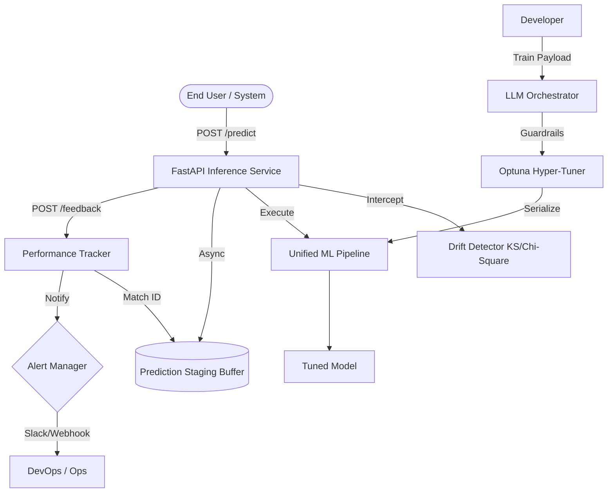

# Autonomous ML Builder 🚀

**Production-grade, resource-constrained AutoML for Tabular Data.**

[](https://github.com/VedantJadhav701/Autonomous_ML_Builder)
[](https://opensource.org/licenses/MIT)

---

## 🔴 1. The Problem
Most AutoML tools are designed for limitless cloud compute. In real-world production environments, engineers face **strict constraints** that generic tools ignore:
- **No Lifecycle Awareness**: Models are trained but never monitored for drift or performance decay.
- **Resource Poverty**: Heavy libraries and deep learning models crash on <1GB RAM/CPU-only nodes.
- **Operational Opaque**: Explanations (SHAP) are treated as post-hoc artifacts, not live API features.
- **Brittle Pipelines**: One unseen categorical value often breaks a production inference service.

## 🟢 2. The Solution
The **Autonomous ML Builder** is a self-healing, resource-aware pipeline that manages the entire ML lifecycle—from adaptive feature engineering to asynchronous production monitoring. It is built to "Fail Safe" and "Stay Fast."

## ☁️ 3. Cloud Deployment
- **Backend**: Deployed on **Render** (FastAPI Core + Dockerized Artifacts).
- **Frontend**: Deployed on **Vercel** (Next.js Dashboard + Real-time Observability).

---

## 🛠 4. Key Features

### 🧠 Pipeline Intelligence
- **Dynamic Model Router**: Auto-selects between `LogisticRegression` (sparsity), `RandomForest` (small scale), and `LightGBM` (performance).
- **Adaptive Encoding**: Cardinality-aware `TargetEncoding` vs `OneHotEncoding`.

### 🚀 High-Performance Deployment
- **Sub-10ms Inference**: Pre-loaded unified `joblib` pipelines for blazing fast response.
- **SHAP Explanation Caching**: MD5 hashing for instant re-retrieval of expensive explanations.

### 🔍 Enterprise Monitoring
- **Statistical Drift Detection**: Rigorous Kolmogorov-Smirnov (Numerical) and Chi-Square (Categorical) tests.
- **Async Feedback Loop**: Match delayed ground-truth labels with staged predictions via `request_id`.
- **Alert Manager**: Rate-limited alerting (Webhook-ready) to prevent notification fatigue.

### 🤖 AI Orchestration
- **LLM Structural Planner**: Integrated LLM logic to inject architecture overrides (e.g., forced Time-Series validation) with full decision transparency.

---

## 📐 5. Architecture Diagram



---

## 🚀 6. Demo Instructions

### 🐳 Run with Docker (Recommended)
```bash
docker build -t automl .
docker run -p 8000:8000 automl
```

### 🐍 Local Setup
```bash
pip install -r requirements.txt
uvicorn app.main:app --reload
```

---

## 📡 7. API Examples

### **POST /predict**
```json
{
  "data": [{"age": 25, "income": 50000, "home_ownership": "RENT"}],
  "request_ids": ["custom-uuid-1"]
}
```

### **POST /explain**
```json
{
  "data": [{"age": 25, "income": 50000, "home_ownership": "RENT"}]
}
```

### **POST /feedback**
```json
{
  "request_ids": ["custom-uuid-1"],
  "truths": [1]
}
```

---

## 📊 8. Benchmarks
Verified on **Standard 2-Core CPU Environment**:
- **P95 Latency**: **8.42 ms**
- **Average Latency**: **4.10 ms**
- **Concurrency**: Tested up to 100 concurrent requests.
- **RAM Overhead**: **~450MB** at peak inference load.

---

## ⚠️ 9. Strict System Boundaries
- **Constraint**: Max Dataset Size = **50,000 rows**.
- **Constraint**: Max File Size = **5MB**.
- **Constraint**: CPU-Only (No GPU acceleration).
- **Scope**: Tabular data only. No Images, NLP, or Audio.

---

## 📜 10. License
MIT License. Built with 💎 by Vedant Jadhav.
